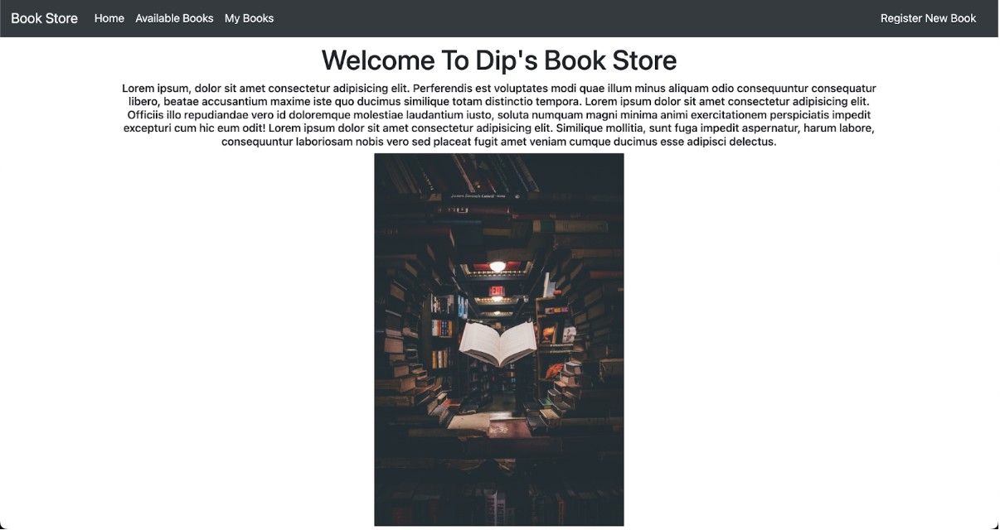

**Documentation For Book Store Management System**

Design and Developed By

Dipanjan Ghosh

Objective:The primary objective of a bookstore management system is to provide a user-friendly platform that enables bookstore owners to efficiently manage their inventory, sales, and customer data. The system should have the following objectives:

- Inventory management: The system should keep track of the bookstore's inventory, including books, magazines, and other related items. The system should allow bookstore owners to add new items, update the stock levels, and remove outdated or out-of-stock items.

- Sales management: The system should enable the bookstore owner to manage their sales, including generating invoices, processing payments, and managing refunds or returns.

- Customer management: The system should allow the bookstore owner to maintain a database of their customers, including their contact details, purchase history, and preferences. The system should enable the owner to create customer profiles, track their purchasing behaviour, and offer personalised recommendations.

- Reporting and analytics: The system should provide real-time reports and analytics, enabling the bookstore owner to monitor their sales, inventory, and customer data. The system should provide insights into popular items, sales trends, and customer behaviour.

- User-friendly interface: The system should have an intuitive and user-friendly interface, making it easy for bookstore owners to manage their operations without the need for extensive technical expertise.

By achieving these objectives, a bookstore management system can help bookstore owners streamline their operations, increase their efficiency, and enhance the overall customer experience.

Technology User in the project:

For FrontEnd :

- Bootstrap, thymeLeaf(Spring Boot dependency)

For Backend:

- Spring Boot

For Database:

- Mysql

Dependencies Used For Spring Boot:

- Spring Data JPA
- Thymeleaf
- Spring WEB
- Spring Boot DEVTools
- Spring MySql connector

IDE used:

- IntelliJ IDEA CE

Demo Of My Design:

Frontend:

-\> This is the landing page of the bookstore.

Functionalities: The functionalities are,

In the above image after clicking the "Register New Book" Button a form is opened.

In the Above image the after clicking the submit button the book is submitted showing on the page "Available Books".

Here we can edit and delete the books and also we can add multiple books to the "My Books" section.

In the above image the "My Book" section is shown. Here we can delete the books from my book section and it will not affect the "Available Book" section.

Lastly, after clicking the "Home" button we are going back to the landing page.

Use Cases:The use cases of a bookstore management system are as follows:

- Inventory Management: The system can track the stock of books, manage the stock levels, and automatically reorder books when the stock runs low.
- Point of Sale: The system can handle the sales process by managing transactions, generating receipts, and updating the inventory in real-time.
- Customer Management: The system can maintain customer records, manage customer accounts, and provide personalised recommendations based on their purchase history.
- Online Sales: The system can facilitate online sales by integrating with e-commerce platforms, managing orders, and updating inventory levels.
- Reporting and Analytics: The system can generate reports on sales, inventory, customer behaviour, and other key metrics to help store owners make informed decisions.
- Employee Management: The system can manage employee schedules, track employee hours, and process payroll.
- Marketing and Promotions: The system can facilitate promotions, discounts, and loyalty programs to attract and retain customers.
- Book Recommendation Engine: The system can use customer data to provide personalised book recommendations based on their reading history, preferences, and purchase behaviour.

Overall, a bookstore management system can help bookstores to operate more efficiently, improve customer satisfaction, and increase revenue.

Conclusion:In conclusion, a bookstore management system is an essential tool for any bookstore that wants to streamline its operations, improve customer experience, and increase sales. With features such as inventory management, point of sale, customer management, online sales, reporting and analytics, employee management, marketing and promotions, and book recommendation engine, a bookstore management system can help bookstores to automate their processes, make informed decisions, and provide personalised services to customers. By investing in a bookstore management system, bookstores can stay competitive in today's digital age and meet the evolving needs of their customers.
